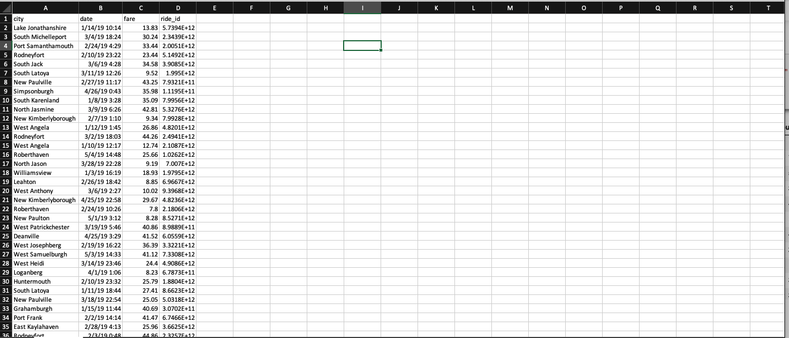
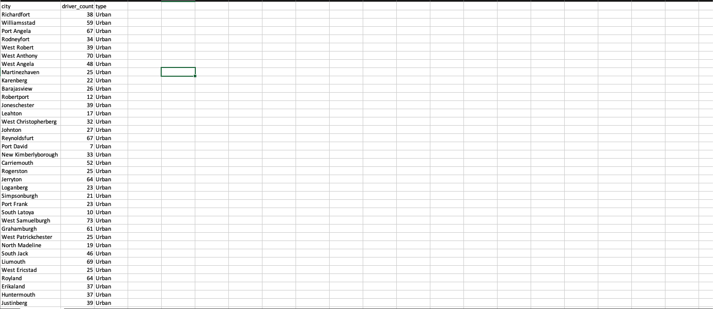
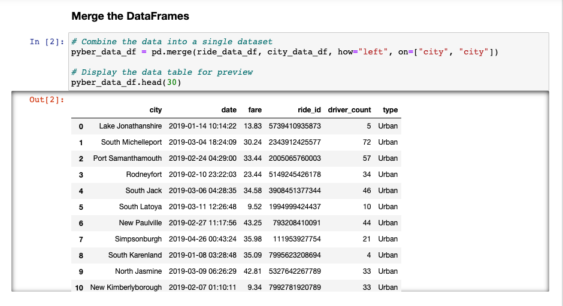
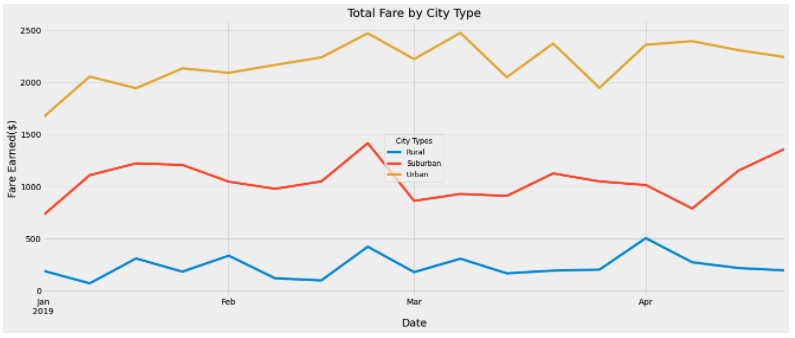

# PyBer_Analysis
## Overview of Analysis
The Vanderbilt University Data Analytics Bootcamp is a streamline of coursework that exposes students to a broad set of technical applications and data management concepts, strengthening their problem solving skills in data-driven contexts. Module 5 focuses on using Matplotlib in Jupyter Notebook to clean, group and analyze data from CSVs detailing ride data from Pyber, a ride sharing company, highlighting trends within Urban, Suburban, and Rural contexts.  

Pyber provided datasheets detailing the number of drivers and region type (urban, suburban, or rural) for 120 cities ([Data Resources - Cities](Resources/CityData_CSV.png)) within their coverage, as well the location, date/time, fare amount ($) and ride id's for 2,376 rides occuring in those regions ([Data Resources - Rides](Resources/RideData_CSV.png)) in 2019.  

[Data Resources - Rides](Resources/RideData_CSV.png)

[Data Resources - Cities](Resources/CityData_CSV.png)

Using import functions with Pandas in a jupyter notebook, the two datasheets were merged into a single dataframe.  Insights, such as average fare generated per driver in a region, or average fare per ride in a given region, could be gleaned to deepen the understanding of trends across, urban, rural, and suburban regions with the merged dataframe.

[Merging Datasheets](Resources/DataMerge.png)

## Results

Results:

[Trends by City Type](Resources/Trends_CityType.png)

[Total Fare by City Type](Resources/Pyber_Results.png)

Urban areas emerged as the region type generating the greatest revenue, as the total number of rides in that region type (1625) more than doubled that of Suburban (625 rides) and Rural (125) areas combined in the timeperiod of the study (Jan. 1, 2019 - April 29, 2019).  Total Fares in Urban regions ($39,854.38) greatly outperformed those in Suburban ($19,356.33) and Rural regions ($4,327.93) in spite of the lower revenues earned per Urban ride ($24.53 per ride vs. $30.97 and $34.62, respectively).

If driver dissatisfaction has been a trend in Urban areas, the low average fare per driver may explain it.  Drivers in Urban areas make an average of $16.57, lower than the average fare per ride.  This indicates that is not enough business for the supply of drivers in Urban regions, and that some registered drivers are yet to have provided any ridesharing service. 

Incentivizing Urban drivers to provide service in more Rural regions, or between Rural and Urban areas, may help drive up average fares per driver, as Rural regions tends to provide more lucrative fares. It might also be worth exploring capping the number of registered drivers in Urban areas, or revamping marketing startegies in Urban areas to better leverage the supply of drivers in that region type.
